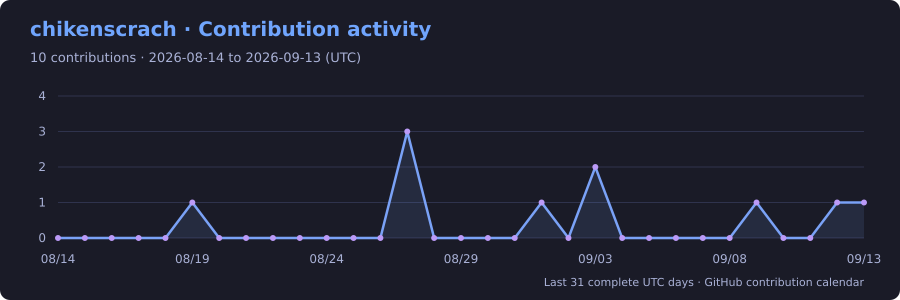

<!-- Profile README · chikenscrach -->

  

  <strong>Building useful things, one small project at a time.</strong> 
  Developer from Taiwan · Python &amp; JavaScript · Linux enthusiast

  
  
  

## A little about me

- 🤖 I build **Discord bots, AI integrations and practical automation tools**.
- 🧠 I'm exploring **deep learning, computer vision and systems programming**.
- 🐧 I enjoy working with **Linux**, experimenting with new tools, and sharing things on **YouTube**.

## Selected projects

| Project | What it does | Built with |
| :--- | :--- | :--- |
| [**GPTjsbot**](https://github.com/chikenscrach/GPTjsbot) | A Discord bot with AI chat, link previews and reminders. | JavaScript · Node.js · Docker |
| [**ddpybot**](https://github.com/chikenscrach/ddpybot) | A modular Discord bot with AI conversations, earthquake information and community tools. | Python · discord.py · uv |
| [**ColabDL**](https://github.com/chikenscrach/ColabDL) | Download files in Google Colab and transfer them to cloud storage. | Python · Jupyter · Google Colab |

## My toolbox

  
  
  
  
  
  

More languages, libraries &amp; tools

| Area | Technologies |
| :--- | :--- |
| Languages | C · C++ · Java · MATLAB |
| AI &amp; computer vision | PyTorch · TensorFlow · OpenCV |
| Databases | MySQL · SQLite |

## 📊 GitHub Stats

  
  

  Language proportions reflect repository contents, not proficiency.

## 📈 Contribution activity

  

### Contributions over the past year

<!-- Annual heatmap replaces the unavailable 31-day activity graph. -->

  

🏆 GitHub trophies

  

---

  Thanks for stopping by. Feel free to explore a project or say hello 👋

